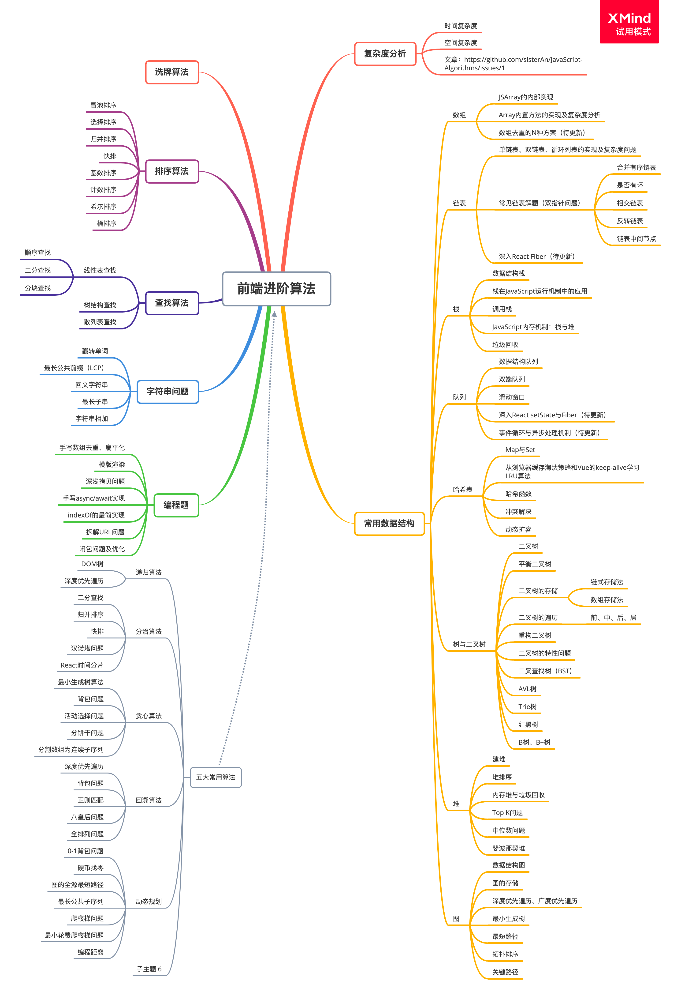

基于「前端瓶子君」的整理刷算法题

参考链接：https://github.com/sisterAn/JavaScript-Algorithms

### 数组篇
* [leetcode88.合并两个有序数组](https://github.com/cyh756085049/web-system/blob/main/algorithms/leetcode/array/mergeSortArray.js)
* [leetcode1：两数之和【字节】](https://github.com/cyh756085049/web-system/blob/main/algorithms/leetcode/array/towSum.js)
* [leetcode15：三数之和【腾讯】](https://github.com/cyh756085049/web-system/blob/main/algorithms/leetcode/array/threeSum.js)
* [N数之和【字节】](https://github.com/cyh756085049/web-system/blob/main/algorithms/leetcode/array/nSum.js)
* [数组扁平化、去重、排序【腾讯】](https://github.com/cyh756085049/web-system/blob/main/algorithms/leetcode/array/flattenSortArray.js)
* [leetcode349：求两个数组的交集/并集/差集](https://github.com/cyh756085049/web-system/blob/main/algorithms/leetcode/array/intersection.js)
* [leetcode146：设计和实现一个LRU（最近最少使用）缓存机制【华为】](https://github.com/cyh756085049/web-system/blob/main/algorithms/leetcode/array/LRUCache.js)
* [编写一个函数计算多个数组的交集](https://github.com/cyh756085049/web-system/blob/main/algorithms/leetcode/array/moreIntersection.js)
* [leetcode611：有效三角形的个数【腾讯】](https://github.com/cyh756085049/web-system/blob/main/algorithms/leetcode/array/triangleNumber.js)
* [leetcode42：接雨水问题](https://github.com/cyh756085049/web-system/blob/main/algorithms/leetcode/array/trap.js)
* [leetcode380：O(1) 时间插入、删除和获取随机元素【字节】](https://github.com/cyh756085049/web-system/blob/main/algorithms/leetcode/array/randomizedSet.js)
* [剑指 Offer 50. 第一个只出现一次的字符](https://github.com/cyh756085049/web-system/blob/main/algorithms/leetcode/array/firstUniqChar.js)

### 字符串篇
* [leetcode151. 反转字符串中的单词【字节】](https://github.com/cyh756085049/web-system/blob/main/algorithms/leetcode/string/reverseWords.js)
* [leetcode14. 最长公共前缀【拼多多、网易】](https://github.com/cyh756085049/web-system/blob/main/algorithms/leetcode/string/reverseWords.js)
* [leetcode125. 验证回文串【百度】](https://github.com/cyh756085049/web-system/blob/main/algorithms/leetcode/string/isPalindrome.js)
* [leetcode3. 无重复字符的最长子串【字节】](https://github.com/cyh756085049/web-system/blob/main/algorithms/leetcode/string/lengthOfLongSubstring.js)
* [leetcode415. 字符串相加【facebook、字节、腾讯、哔哩哔哩】](https://github.com/cyh756085049/web-system/blob/main/algorithms/leetcode/string/addStrings.js)
* [leetcode43. 字符串相乘【腾讯】](https://github.com/cyh756085049/web-system/blob/main/algorithms/leetcode/string/multiply.js)
* [leetcode8. 字符串转换整数 (atoi)【腾讯】](https://github.com/cyh756085049/web-system/blob/main/algorithms/leetcode/string/myAtoi.js)

### 链表篇
* [leetcode21：合并两个有序链表](https://github.com/cyh756085049/web-system/blob/main/algorithms/leetcode/list-node/mergeTwoLists.js)
* [leetcode141：判断一个链表是否有环【有赞】](https://github.com/cyh756085049/web-system/blob/main/algorithms/leetcode/list-node/hasCycle.js)
* [leetcode206：反转链表](https://github.com/cyh756085049/web-system/blob/main/algorithms/leetcode/list-node/reverseList.js)
* [leetcode876：链表的中间结点](https://github.com/cyh756085049/web-system/blob/main/algorithms/leetcode/list-node/middleNode.js)
* [leetcode19：删除链表的倒数第 N 个结点](https://github.com/cyh756085049/web-system/blob/main/algorithms/leetcode/list-node/removeNthFromEnd.js)
* [leetcode160：两个单链表的相交结点【字节】](https://github.com/cyh756085049/web-system/blob/main/algorithms/leetcode/list-node/getIntersectionNode.js)
* [leetcode：面试题02.05.链表求和【快手】](https://github.com/cyh756085049/web-system/blob/main/algorithms/leetcode/list-node/addTwoNumbers.js)

### 栈篇
* [leetcode155. 最小栈【字节】](https://github.com/cyh756085049/web-system/blob/main/algorithms/leetcode/stack/minStack.js)
* [leetcode20. 有效的括号【腾讯、哔哩哔哩】](https://github.com/cyh756085049/web-system/blob/main/algorithms/leetcode/stack/isValid.js)
* [leetcode1047. 删除字符串中的所有相邻重复项](https://github.com/cyh756085049/web-system/blob/main/algorithms/leetcode/stack/removeDuplicates.js)
* [leetcode1209. 删除字符串中的所有相邻重复项 II](https://github.com/cyh756085049/web-system/blob/main/algorithms/leetcode/stack/removeDuplicatesII.js)
* [面试题: 删除字符串中出现次数 >= 2 次的相邻字符【字节】](https://github.com/cyh756085049/web-system/blob/main/algorithms/leetcode/stack/removeDuplicatesStr.js)

### 堆篇
* [159. 库存管理 III（最小的k个数）【字节、腾讯】](https://github.com/cyh756085049/web-system/blob/main/algorithms/leetcode/heap/getLeastNumbers.js)
* [347. 前 K 个高频元素](https://github.com/cyh756085049/web-system/blob/main/algorithms/leetcode/heap/topKFrequent.js)
* [215. 数组中的第K个最大元素](https://github.com/cyh756085049/web-system/blob/main/algorithms/leetcode/heap/findKthLargest.js)
* [295. 数据流的中位数](https://github.com/cyh756085049/web-system/blob/main/algorithms/leetcode/heap/medianFinder.js)

### 队列篇
* [剑指 Offer 09. 用两个栈实现队列【腾讯】](https://github.com/cyh756085049/web-system/blob/main/algorithms/leetcode/queue/CQueue.js)
* [Leetcode239. 滑动窗口最大值](https://github.com/cyh756085049/web-system/blob/main/algorithms/leetcode/queue/maxSlidingWindow.js)
* [leetcode151. 反转字符串中的单词【字节】](https://github.com/cyh756085049/web-system/blob/main/algorithms/leetcode/string/reverseWords.js)
* [Leetcode3：无重复字符的最长子串【字节】](https://github.com/cyh756085049/web-system/blob/main/algorithms/leetcode/string/lengthOfLongestSubstring.js)

### 二叉树篇
* [144. 二叉树的前序遍历【字节】](https://github.com/cyh756085049/web-system/blob/main/algorithms/leetcode/tree/preorderTraversal.js)
* [94. 二叉树的中序遍历【字节】](https://github.com/cyh756085049/web-system/blob/main/algorithms/leetcode/tree/inorderTraversal.js)
* [145. 二叉树的后序遍历【字节】](https://github.com/cyh756085049/web-system/blob/main/algorithms/leetcode/tree/postorderTraversal.js)
* [102. 二叉树的层序遍历【字节】](https://github.com/cyh756085049/web-system/blob/main/algorithms/leetcode/tree/levelorderTraversal.js)
* [107. 二叉树的层序遍历II【字节】](https://github.com/cyh756085049/web-system/blob/main/algorithms/leetcode/tree/levelorderBottom.js)
* [105. 从前序与中序遍历序列构造二叉树](https://github.com/cyh756085049/web-system/blob/main/algorithms/leetcode/tree/buildTree.js)
* [104. 二叉树的最大深度【腾讯】](https://github.com/cyh756085049/web-system/blob/main/algorithms/leetcode/tree/maxDepth.js)
* [236. 二叉树的最近公共祖先【腾讯、字节】](https://github.com/cyh756085049/web-system/blob/main/algorithms/leetcode/tree/lowestCommonAncestor.js)
* [110. 平衡二叉树【剑指offer】](https://github.com/cyh756085049/web-system/blob/main/algorithms/leetcode/tree/isBalanced.js)
* [112. 路径总和【字节】](https://github.com/cyh756085049/web-system/blob/main/algorithms/leetcode/tree/hasPathSum.js)
* [101. 对称二叉树【剑指offer】](https://github.com/cyh756085049/web-system/blob/main/algorithms/leetcode/tree/isSymmetric.js)
* [求二叉树中两个指定节点间的最短距离【字节】](https://github.com/cyh756085049/web-system/blob/main/algorithms/leetcode/tree/shortestDistance.js)
* [230. 二叉搜索树中第K小的元素【腾讯】](https://github.com/cyh756085049/web-system/blob/main/algorithms/leetcode/tree/kthSmallest.js)
* [226. 翻转二叉树【美团】](https://github.com/cyh756085049/web-system/blob/main/algorithms/leetcode/tree/invertTree.js)