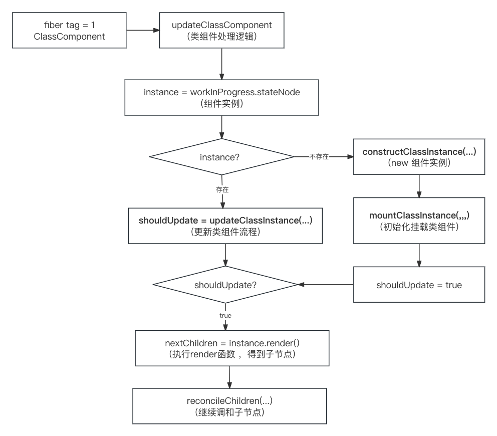
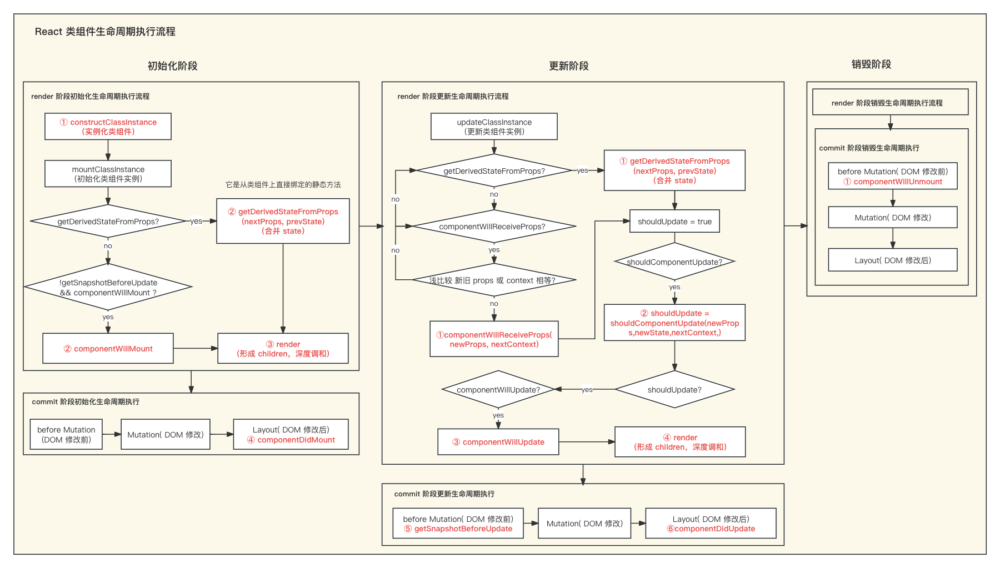

### React 类组件调和阶段处理逻辑？

React 在调和(render)阶段会深度遍历 React fiber 树，目的就是发现不同(diff)，不同的地方就是接下来需要更新的地方，对于变化的组件，就会执行 render 函数。在一次调和过程完毕之后，就到了commit 阶段，commit 阶段会创建修改真实的 DOM 节点。

如果在一次调和的过程中，发现了一个 `fiber tag = 1 `类组件的情况，就会按照类组件的逻辑来处理。对于类组件的处理逻辑如下：

* 首先判断类组件是否已经被创建过
    * 如果不存在类组件实例，则需要先通过 `constructClassInstance` 进行创建 `new`，然后执行 `mountClassInstance` 进行初始化组件挂载流程，设置 `shouldUpdate = true` 为组件需要更新的标识
    * 如果存在类组件实例，则执行 `updateClassInstance` 进行更新组件流程，并将其返回值赋给 `shouldUpdate`。
* 判断 `shouldUpdate` 组件是否应该更新，如果需要更新，则执行 `render`函数，得到子节点，然后继续调和子节点。

在组件实例上可以通过 `_reactInternals` 属性来访问组件对应的 `fiber` 对象。在 `fiber` 对象上，可以通过 `stateNode` 来访问当前 fiber 对应的组件实例

### React 类组件生命周期执行流程？

React 的大部分生命周期的执行，都在 `mountClassInstance` 和`updateClassInstance` 这两个方法中执行，接下来将按照 **组件初始化**，**组件更新** ， **组件销毁** ，三大阶段分析。

* 组件初始化阶段： `constructor`[组件实例化] -> `getDerivedStateFromProps` [类组件上直接绑定的静态方法，传入 `props`，`state`, 返回合并后的 `state`]/ `componentWillMount`[完成一些初始化操作] -> `render`[创建 `React.element` 元素的过程] -> `componentDidMount`[`DOM` 已经创建完，可以做一些基于 `DOM` 操作, 如 `DOM` 事件监听器，也可以初始化向服务器请求数据，渲染视图]
* 组件更新阶段：`componentWillReceiveProps`[父组件更新带来的`props` 改变] / `getDerivedStateFromProp`[类组件上直接绑定的静态方法，传入 `props`，`state`, 返回合并后的 `state`] -> `shouldComponentUpdate`[一般用于性能优化，返回值决定是否重新渲染类组件] -> `componentWillUpdate`[在更新之前，此时的 `DOM` 还没有更新, 可以获取组件更新之前的状态在，可以做一些获取 `DOM` 的操作] -> `render`[创建 `React.element` 元素的过程] -> `getSnapshotBeforeUpdate`[获取更新前 DOM 的状态, 配合`componentDidUpdate` 一起使用，计算形成一个 `snapShot` 传递给 `componentDidUpdate` ，保存一次更新前的信息] -> `componentDidUpdate`[[`DOM` 已经创建完，可以做一些基于 `DOM` 操作， 如 `DOM` 事件监听器]
* 组件销毁阶段：`componentWillUnmount`[做一些收尾工作，比如清除一些可能造成内存泄漏的定时器，延时器，或者是一些事件监听器]

### 函数组件的生命周期替换方案是什么样的？

`componentDidMount`: `useEffect`依赖项为空数组的时候，替代 `componentDidMount`， 初始化时执行一次，但 `useEffect` 是异步执行，`componentDidMount` 是同步执行。

`componentWillUnmount`: `useEffect` 第一个参数 `callback` 的返回函数，可以作为 `componentWillUnmount` 使用。

`componentWillReceiveProps`: `useEffect`依赖项为 `props` 的时候类似，但两者有差别：二者的执行阶段根本不同，`componentWillReceiveProps` 个是在 `render` 阶段，`useEffect` 是在 `commit` 阶段，`useEffect` 会在初始化和组件更新 `props` 变化时均执行，但是 `componentWillReceiveProps` 只有组件更新 `props` 变化的时候才会执行。

`componentDidUpdate`: `useEffect` 没有依赖项的时候，会在初始化和每次组件更新后都执行。两者有一些差别：`useEffect` 是异步执行，`componentDidUpdate` 是同步执行 ，但都是在 `commit` 阶段 , `useEffect`会默认执行一次，而 `componentDidUpdate` 只有在组件更新完成后执行。

### 