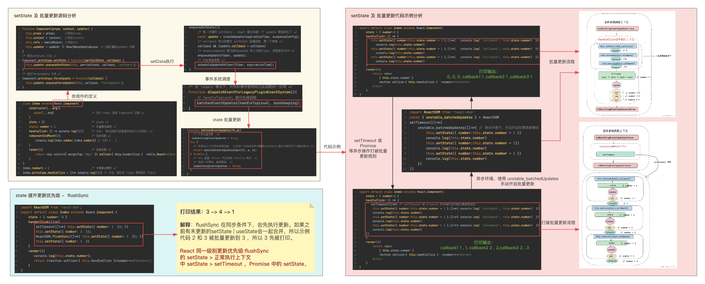
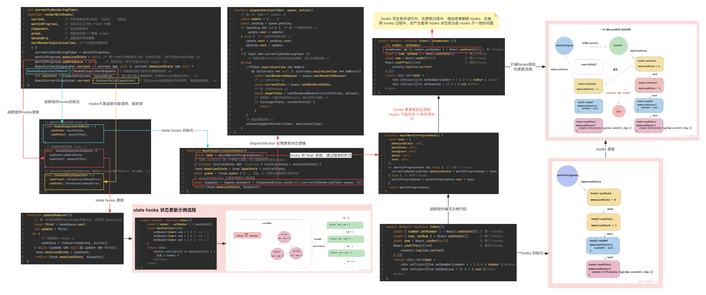

### React 类组件中 setState 函数做了哪些事情？

> **`setState(obj①, callback②)`**
>
> -  ①`obj`：如果是一个对象，则为即将合并的 `state`，如果是一个函数，那么当前组件的 `state` 和 `props` 将作为参数，返回值用于合并新的 `state`。
> -  ②`callback`：是一个函数，函数执行上下文中可以获取当前 `setState` 更新后的最新 `state` 的值，可以作为依赖 `state` 变化的副作用函数，可以用来做一些基于 `DOM` 的操作。

我们知道 `setData` 有2个参数，第一个参数是用于合并更新新的 `state`，第二个参数是一个 `callback` 函数，主要可以对获取到的当前最新 `state` 值做一些操作。

触发一次 `setData`，`React` 主要做了以下事情：

- 首先，`setState` 会计算当前更新的优先级（老版本用 `expirationTime` ，新版本用 `lane` ）。
- 接下来 `React` 会从 `fiber Root` 根部 `fiber` 向下调和子节点，调和阶段将对比发生更新的地方，更新对比 `expirationTime` ，找到发生更新的组件，合并 `state`，然后触发 `render` 函数，得到新的 `UI` 视图层，完成 `render` 阶段。
- 接下来到 `commit` 阶段，`commit` 阶段，替换真实 `DOM` ，完成此次更新流程。
- 此时仍然在 `commit` 阶段，会执行 `setState` 中 `callback` 函数，到此为止完成了一次 `setState` 全过程。

**源码层面：**

类组件初始化过程中绑定了负责更新的`Updater`对象，调用 `setState` 方法，实际上是 `React` 底层调用 `Updater` 对象上的 `enqueueSetState` 方法。 `enqueueSetState` 作用就是创建一个 `update` ，然后放入当前 `fiber` 对象的待更新队列中，最后在 `scheduleUpdateOnFiber` 中开启调度更新。

正常 `state` 更新、UI 交互，都离不开用户的事件， `React` 有 `batchUpdate` 批量更新， `React` 是采用事件合成的形式，每一个事件都是由 `React` 事件系统统一调度的，那么 `state` 批量更新正是和事件系统息息相关，在源码中，在 `React` 事件执行之前通过 `isBatchingEventUpdates=true` 打开开关，开启事件批量更新，当该事件结束，再通过 `isBatchingEventUpdates = false` 关闭开关，然后在 `scheduleUpdateOnFiber` 中根据这个开关来确定是否进行批量更新。

但是当在事件执行函数中，使用 `setTimeout、Promise` 等异步函数操作 `setState` 更新，则会打破批处理更新规则，因为`setTimeout、Promise` 创建了新的宏任务，会在下一轮事件循环中执行，而函数末尾将 `isBatchingEventUpdates` 设为了 `false`，所以执行更新时`isBatchingEventUpdates` 为 `false`, 批量更新规则被打破，因此 `setTimeout` 的执行内容是没有批量更新的。

[//]: # (![setData 更新原理]&#40;https://p.ipic.vip/eglis5.png&#41;)

`React flushSync` 更新优先级顺序案例：

> **注意点**：上述源码流程图是基于 `React v18` 之前的版本分析，在setTimeout等异步函数中，执行多个setState，会导致批量更新规则被打破，使用`ReactDom` 的 `unstable_batchedUpdates` 函数可以手动合并，实现在异步函数中的批量更新。在 `React v18` 中 `setState` 都是批量更新机制了，无需再手动处理。

### React 函数组件中 useState 的原理是什么，背后怎么执行的?它怎么保证一个组件中写多个 useState 不会串？

>  **`[①state, ②dispatch] = useState(③initData)`**
>
> - ① `state`：目的提供给`UI`作为渲染视图的数据源。
> - ② `dispatch`：改变 `state` 的函数，可以理解为推动函数组件渲染的渲染函数。对于 `dispatch` 的参数有两种情况：
    >   - 第一种非函数情况，此时将作为新的值，赋予给 `state`，作为下一次渲染使用;
>   - 第二种是函数的情况，如果 `dispatch` 的参数为一个函数，这里可以称它为 `reducer`，`reducer` 参数，是上一次返回最新的 `state`，返回值作为新的 `state`。
> - ③ `initData`：有两种情况，第一种情况是非函数，将作为 `state` 初始化的值。第二种情况是函数，函数的返回值作为 `useState` 初始化的值。

`useState` 底层是执行的 `mountState`方法，主要做了如下工作：

* 首先得到初始化的 `state` , `state` 会被当前 `hooks` 的 `memoizedState` 保存下来，每一个 `useState` 都会创建一个 `queue` 里面保存了更新的信息。
* 每一个 `useState` 都会创建一个更新函数 `dispatchAction`，值得注意一点是，**当前的 `fiber` 被 `bind` 绑定了固定的参数传入 `dispatchAction` 和 `queue` ，所以当用户触发更新函数 `dispatchAction` 的时候，能够直观反映出来自哪个 `fiber` 的更新**。
* 最后把 `memoizedState`、 `dispatch` 返回给开发者使用。

#### React 函数组件中 useState 是怎么处理更新逻辑的？

当每一次改变 `state` ，底层会做这些事：

- 首先用户每一次调用 `dispatchAction` 都会先创建一个 `update` ，然后把它放入待更新 `pending` 队列中。
- 然后判断当前的 `fiber` 是否正在更新，如果正在更新，说明当前 `fiber` 正在发生调和渲染更新， 那么就不需要再更新了。
- 反之，说明当前 `fiber` 没有更新任务，那么会拿出上一次 `state` 和 这一次 `state` 进行对比，如果相同，那么直接退出更新。如果不相同，那么发起更新调度任务，进行事件批量更新。

`hooks` 的更新逻辑本质上调用的是 `updateReducer`，会把待更新的队列 `pendingQueue` 拿出来，合并到 `baseQueue`，循环进行更新，就可以从 `useState` 中得到最新的值。

[//]: # (![React useState原理]&#40;https://p.ipic.vip/kaceem.png&#41;)

### 在 React 类组件中，为什么修改状态要使用 setState 而不是用 this.state.xxx = xxx？

在 `React` 中，不要直接修改 `state`，而是使用 `setState` 方法来更新状态。直接修改 `state` 可能导致渲染不一致、性能问题和数据流混乱等问题。通过使用 `setState`，可以保证 `React` 正确地更新组件的状态，并遵循单向数据流的设计模式。

具体分析原因：

1. **影响组件的更新机制**：React 使用虚拟 DOM 来管理组件的渲染和更新，通过比较新旧虚拟 DOM 的差异来最小化 DOM 操作，提高性能。如果直接修改 state，React 将无法感知到状态的变化，无法正确更新组件的渲染，可能导致 UI 不一致或性能下降。
2. **可能导致不可预测的结果**：直接修改 state 可能会破坏 React 的内部机制和约定，导致一些不可预测的问题。React 依赖于合成事件 (SyntheticEvent) 和批量更新机制来优化性能，直接修改 state 可能会绕过这些机制，引发问题。
3. **破坏单向数据流**：React 推崇单向数据流的设计模式，通过将数据从父组件传递给子组件，保持数据的一致性和可追踪性。直接修改 state 可能导致数据流的混乱，增加代码的复杂性。

### React 组件如何监听 state 变化？

* 类组件 `setState` 中，有第二个参数 `callback` 或者是生命周期 `componentDidUpdate` 可以检测监听到 `state` 改变或是组件更新。
* 函数组件中，使用 `useEffect`，通常可以把 `state` 作为依赖项传入 `useEffect` 第二个参数 `deps` ，但是注意 `useEffect` 初始化会默认执行一次。还可以通过 `useState` 的 `dispatch` 可以接收一个函数，函数的回调参数就是最新 `state` 的值。

### React 类组件如何限制 state 更新视图？

- `pureComponent` 纯组件可以对 `state` 和 `props` 进行浅比较，如果没有发生变化，那么组件不更新。
- `shouldComponentUpdate` 生命周期可以通过判断前后 `state` 变化来决定组件需不需要更新，需要更新返回`true`，否则返回`false`。

### React 类组件中的 `setState` 和函数组件中的 `useState` 有什么异同？

**相同点：**

- 从原理角度出发，`setState` 和 `useState` 更新视图，底层都调用了 `scheduleUpdateOnFiber` 事件系统调度更新方法，而且事件驱动情况下都有批量更新规则。

**不同点**

- 类组件中，在不是 `pureComponent` 组件模式下， `setState` 不会浅比较两次 `state` 的值，只要调用 `setState`，在没有其他优化手段的前提下，就会执行更新。但是 `useState` 中的 `dispatchAction` 会默认比较两次 `state` 是否相同，然后决定是否更新组件。
- `setState` 有专门监听 `state` 变化的回调函数 `callback`，可以获取最新 `state`；但是在函数组件中，只能通过 `useEffect` 来执行 `state` 变化引起的副作用。
- `setState` 在底层处理逻辑上主要是和老 `state` 进行合并处理，而 `useState` 更倾向于重新赋值。

### 函数组件重新渲染的时候怎么拿到useState之前的状态，而不是得到初始化的状态？

hooks 链表，双缓存树，初始化的时候会保存第一次的状态，然后更新的时候，会根据之前的 `hooks` 复制一份，然后对比上一次 `state` 和 这一次 `state` 进行更新操作。